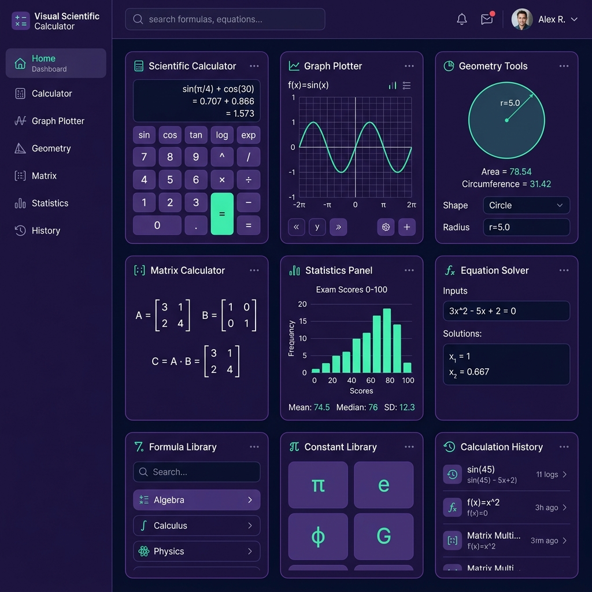
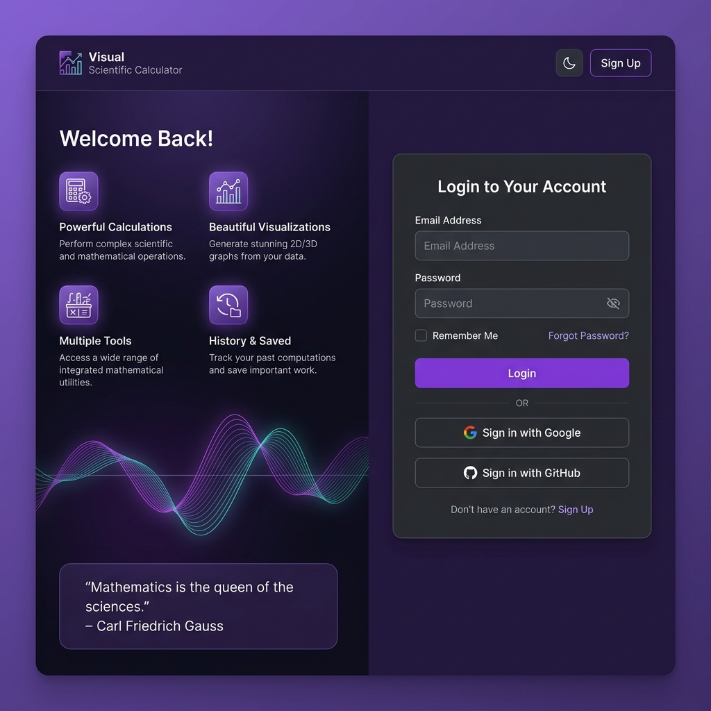

# 🧮 Visual Scientific Calculator — MERN Stack

A modern, full-stack **MERN (MongoDB, Express, React, Node.js)** application for scientific calculations, function plotting, matrix algebra, geometry calculations, statistics analysis, and session history management.


---

## 📸 Application Screenshots

### 📊 Dashboard Interface


### 🔐 Authentication & Login Page


---

## ✨ Features & Highlights

### 🔐 Authentication & User Profiles
- **Modern Glassmorphism Auth UI**: Pixel-perfect login/signup interface featuring feature highlights, mathematical vector graphics, and inspirational quotes.
- **Manual Authentication**: Email & Password registration and login powered by `bcryptjs` password hashing and `jsonwebtoken` (JWT) authentication.
- **Sign in with Google**: Interactive Google OAuth 2.0 authentication flow with instant account creation/login.
- **GitHub Auth Placeholder**: GitHub authentication option with custom notification badges ("Coming Soon").
- **Password Reset**: Interactive password recovery modal with email dispatch feedback.
- **Persistent User Sessions**: User session state saved in `localStorage`, featuring dynamic header avatar and logout dropdown menu.

### 📐 Interactive Dashboard & Calculators
- **Static / Fixed Navigation Frame**: Header and Sidebar remain locked at `top-0` with glassmorphism backdrop blur (`backdrop-blur-md`) when scrolling.
- **Scientific Calculator**: Safe expression evaluation (shunting-yard algorithm, no `eval`), DEG/RAD toggle, trigonometric (`sin`/`cos`/`tan`), logarithmic (`log`/`ln`), powers, roots, and percentages.
- **Function Plotter**: Interactive function curve plotting (`y = sin(x)`, `y = cos(x)`, `y = x²`, `y = √x`, `y = ln(x)`) with adjustable X/Y Min/Max parameters and hover tooltips.
- **Geometry Calculator**: Live area and perimeter computations for Circle, Square, Rectangle, and Triangle with SVG shape preview diagrams and formula footers.
- **Matrix Calculator**: Addition, subtraction, multiplication, inverse, and determinant for matrices with formatted bracket displays.
- **Statistics Engine**: Computes Mean, Median, Mode, Standard Deviation, and renders a frequency bar chart from comma-separated datasets.
- **History & Favorites**: Save calculations to MongoDB database via Express API; star favorite equations, delete single items, or clear all history. Includes graceful in-memory fallback if database is offline.

---

## ⚡ Single Command Quick Start

Start both the **Backend API (Port 5000)** and **Frontend (Port 5173)** simultaneously with **one single command** from the root repository folder:

```bash
# Clone the repository
git clone https://github.com/Ruchitha-n5/Smart_Calcy.git
cd Smart_Calcy

# Install all dependencies (Root, Backend, and Frontend)
npm run install-all

# Start both Frontend & Backend concurrently
npm run dev
```

Open **[http://localhost:5173](http://localhost:5173)** in your browser to view the application.

---

## 📂 Project Structure

```
Smart_Calcy/
├── package.json                  # Root delegator script (npm run dev)
├── .gitignore                    # Git exclusions (node_modules, .env, dist)
├── README.md                     # Main repository documentation
└── mern-calculator/              # Full-Stack MERN codebase
    ├── package.json              # Concurrently script configuration
    ├── backend/                  # Express API + MongoDB models
    │   ├── config/db.js          # MongoDB connection handler
    │   ├── controllers/          # authController & historyController
    │   ├── models/               # User & History Mongoose schemas
    │   ├── routes/               # authRoutes & historyRoutes
    │   ├── server.js             # Express app entry point
    │   ├── .env                  # Backend environment config (Port, MONGO_URI, JWT_SECRET)
    │   └── package.json
    └── frontend/                 # React app (Vite + Tailwind CSS + Recharts)
        ├── src/
        │   ├── api/              # authApi & historyApi axios services
        │   ├── components/       # LoginPage, Header, Sidebar, Hero,
        │   │                     ScientificCalculator, FunctionPlotter,
        │   │                     GeometryCalculator, MatrixCalculator,
        │   │                     Statistics, HistoryPanel
        │   ├── utils/            # mathParser.js (expression evaluator)
        │   ├── App.jsx           # Main application state & routing
        │   └── index.css         # Tailwind base styles & theme utilities
        ├── .env                  # Frontend API URL configuration
        └── package.json
```

---

## ⚙️ Manual Setup & Environment Configuration

If you prefer starting the backend and frontend separately in distinct terminal tabs:

### 1. Backend Setup
```bash
cd mern-calculator/backend
npm install
npm run dev
```
- Starts backend server on `http://localhost:5000`.
- Requires MongoDB running locally (`mongodb://127.0.0.1:27017/visual_calculator`) or a [MongoDB Atlas](https://www.mongodb.com/atlas) connection string in `.env`.

### 2. Frontend Setup
```bash
cd mern-calculator/frontend
npm install
npm run dev
```
- Starts Vite dev server on `http://localhost:5173`.

---

## 🛠️ Built With

- **Frontend**: React 18, Vite, Tailwind CSS, Recharts, Lucide React Icons, Axios
- **Backend**: Node.js, Express.js, MongoDB, Mongoose, JSON Web Tokens (JWT), BcryptJS, Concurrently

---

## 📄 License

This project is open-source and available under the [MIT License](LICENSE).
